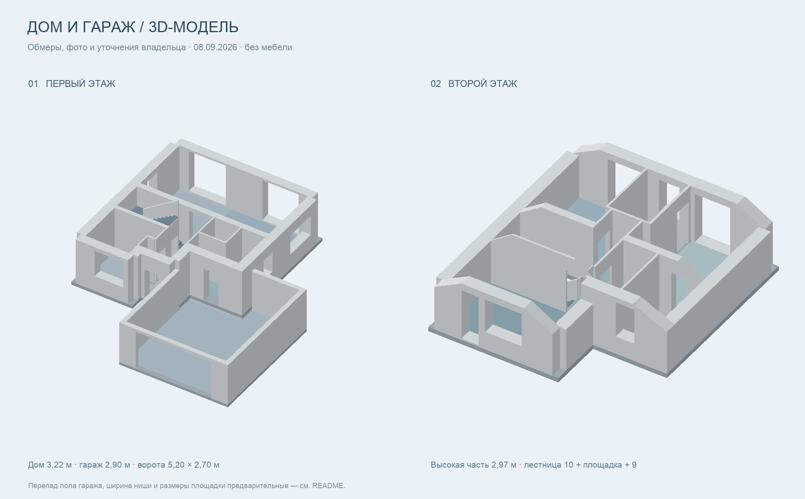

# Домик — редактируемая 3D-модель дома

Два этажа, пристроенный гараж, бетонная лестница с площадкой, проёмы и скошенные потолки, без мебели. После review владельца высоты принимаются по RoomPlan: первый этаж **3,03 м**, высокая часть второго **3,045 м**, гараж **2,927 м**.

[Открыть просмотрщик](https://se7en-ru.github.io/domik/)

В просмотрщике появился режим **«Размеры»**: он показывает на чертёжном плане длины стен и сторон помещений, ширину × высоту проёмов, отметки высот и лестницу. Стену можно нажать для развёртки с простенками, высотой, толщиной и проёмами. План масштабируется колесом и перетаскиванием, единицы переключаются между миллиметрами и метрами, чертёж можно скачать в SVG.

Гараж после review: ширина около 6,36 м, боковые стены 6,38 / 7,13 м, проём ворот 4,74 м, потолок 2,927 м; контур и выступ стены — по скану, одобрены владельцем. Высота ворот 2,70 м сохранена отдельно: RoomPlan не распознал ворота как отдельную поверхность. Лестница: подтверждённые 10 проступей до площадки и 9 после неё.



Обзор выше сделан до уточнения толщин и контура гаража по RoomPlan. Актуальная геометрия — в просмотрщике после локальной сборки.

## Включить GitHub Pages

1. Откройте [Settings → Pages](https://github.com/Se7en-RU/domik/settings/pages).
2. В **Build and deployment → Source** выберите **GitHub Actions**.
3. Откройте [Actions → Build and deploy Pages](https://github.com/Se7en-RU/domik/actions/workflows/pages.yml), нажмите **Run workflow**, выберите `main` и запустите.
4. После успешного шага `deploy` адрес сайта появится в окружении `github-pages`. Ожидаемый стандартный адрес: **https://se7en-ru.github.io/domik/**.

До включения Pages workflow проверяет и собирает проект, затем пропускает публикацию. После включения каждый push в `main` обновляет сайт автоматически. Pull request только проверяется и собирается. Токены и отдельный сервер не нужны: используется стандартный `GITHUB_TOKEN` Actions.

Документация GitHub: [публикация через собственный workflow](https://docs.github.com/en/pages/getting-started-with-github-pages/using-custom-workflows-with-github-pages).

## Локальный запуск

Нужны Node.js 24 и npm. Если установлен nvm, выполните `nvm use`.

```sh
npm ci
npm run dev
```

Откройте **http://localhost:5173**. Vite следит за исходниками и обновляет страницу при изменениях.

## Сборка и экспорт

```sh
npm run typecheck
npm run build
npm run preview
```

Готовый сайт доступен локально на **http://localhost:4173**. Каталог `dist/` содержит:

| Файл                | Назначение                                                       |
| ------------------- | ---------------------------------------------------------------- |
| `index.html`        | Сайт для Pages, все библиотеки и планы встроены                  |
| `house-viewer.html` | Тот же просмотрщик для открытия двойным щелчком без интернета    |
| `house-model.glb`   | Полная модель glTF 2.0 в метрах, для Blender и других редакторов |
| `house-model.obj`   | Дополнительный экспорт геометрии без MTL                         |
| `house-model.json`  | Параметры модели, комнаты, стены, проёмы и ссылки на источники   |
| `model-builder.mjs` | Общий генератор геометрии на Three.js, использует `layout.mjs`   |
| `layout.mjs`        | Общие расчёты гаража, лестницы и отметок                         |

`npm run build` проверяет модель, собирает просмотрщик и экспортирует все форматы из одних исходников. Для экспорта без пересборки HTML есть `npm run export:model`, для быстрой проверки геометрии — `npm test`. Подробный отчёт проверки сохраняется в `work/geometry-check.json`.

`dist/`, `node_modules/` и `work/` не хранятся в Git. В CI результат сборки доступен как артефакт `github-pages`.

## Как редактировать с Codex

Открывайте задачу в этом репозитории и описывайте нужное изменение, например: «В спальне F2-BED уточни положение окна по новому обмеру, пересобери модель». Постоянные инструкции для агента — в [AGENTS.md](AGENTS.md).

| Что изменить                                           | Исходник                                                                             |
| ------------------------------------------------------ | ------------------------------------------------------------------------------------ |
| Высоты, комнаты, стены, проёмы, подписи, допущения     | [`lib/house.json`](lib/house.json)                                                   |
| Форму лестницы, перекрытий, скосов и способ построения | [`lib/model.mjs`](lib/model.mjs)                                                     |
| Управление просмотрщиком, камеру, экспорт, панели      | [`app/page.tsx`](app/page.tsx)                                                       |
| Внешний вид интерфейса                                 | [`app/globals.css`](app/globals.css)                                                 |
| Проверки геометрии                                     | [`scripts/validate-model.mjs`](scripts/validate-model.mjs)                           |
| Сборку сайта и модели                                  | [`scripts/build.mjs`](scripts/build.mjs), [`scripts/export.mjs`](scripts/export.mjs) |
| Публикацию                                             | [`.github/workflows/pages.yml`](.github/workflows/pages.yml)                         |

Меняйте исходники и выполняйте `npm run format`, `npm run typecheck`, `npm run build`. После проверки результата commit и push в `main` запускают публикацию, если Pages включён.

Изменения высот в открытом просмотрщике временные: кнопка «Сохранить JSON» скачивает новую спецификацию. Чтобы сохранить её для всех следующих открытий, замените `lib/house.json` скачанным файлом и пересоберите проект.

## Обмеры и ограничения

13 исходных RoomPlan JSON сопоставлены с существующей моделью. Применены ручные толщины: стена спальня–ванная **40,5 см**, перегородка у входа под лестницу **13 см**, стена лестница–гостиная/кухня **41,5 см**. Полигоны соседних помещений и ширина верхнего марша согласованы; мебель из сканов не используется.

```sh
npm run measurements:audit  # отчёт и наложения; модель не меняется
npm run measurements:apply  # только связанные правки по ручным контрольным точкам
npm test                    # преобразования RoomPlan, выбросы, контроли и геометрия
```

Исходный план — [measurements/PLAN.md](measurements/PLAN.md), контрольные замеры — [manual/control.json](measurements/manual/control.json), результат — [отчёт](measurements/reports/REVIEW.md) и [наложения сканов](measurements/reports/overlay.html). Команда `measurements:apply` сначала сохраняет diff и проверяет модель, затем применяет только `SAFE TO APPLY`; повторный запуск не меняет геометрию. Расхождения RoomPlan со статусом `REVIEW REQUIRED` остаются для уточнения. Подробности процесса — [measurements/README.md](measurements/README.md).

Новые фото и размеры владельца имеют высший приоритет. Для остального дома приоритет — **«черновой план.pdf»**, технический **«step6_ver3.pdf»** дополняет недостающие сведения. Общие планы обоих этажей сохранены в `public/plans/`. Полные PDF остаются у владельца и не включены в репозиторий.

Размеры помещений, координаты, управление просмотрщиком и все допущения описаны в [docs/MODEL.md](docs/MODEL.md). Толщина перекрытия, детали лестницы и линии переходов скосов требуют уточнения по дополнительным обмерам. Перепад пола гаража принят предварительно 0,35 м; грань GARAGE-W05 выровнена по F1-W08, а контур выступа скана сохранён. Обзорное изображение соответствует версии с гаражом; автоматически при сборке не обновляется.

Просмотрщик работает целиком в браузере на React и Three.js. Его сборка не зависит от прежнего хостинга, API, ключей или абсолютных путей на компьютере.
