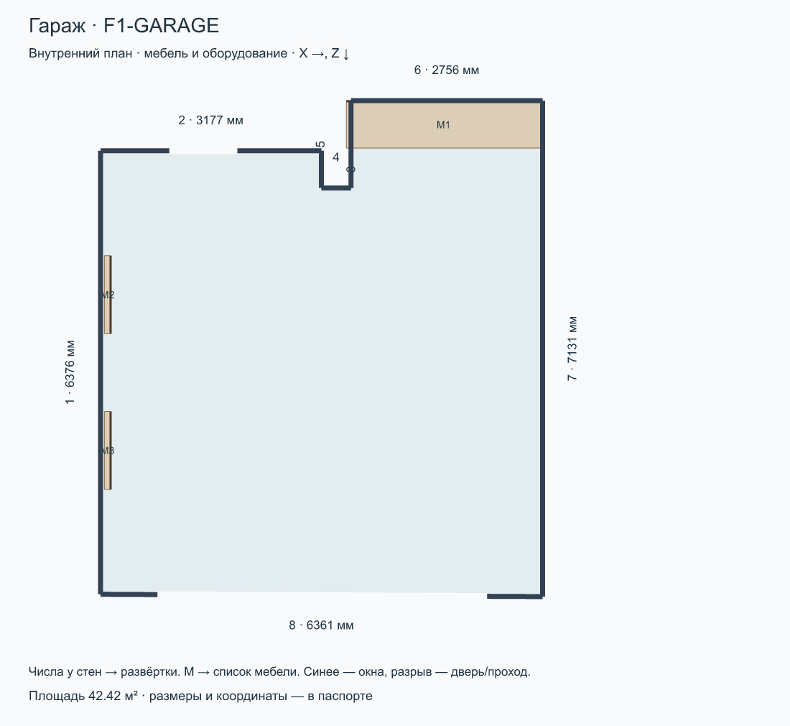
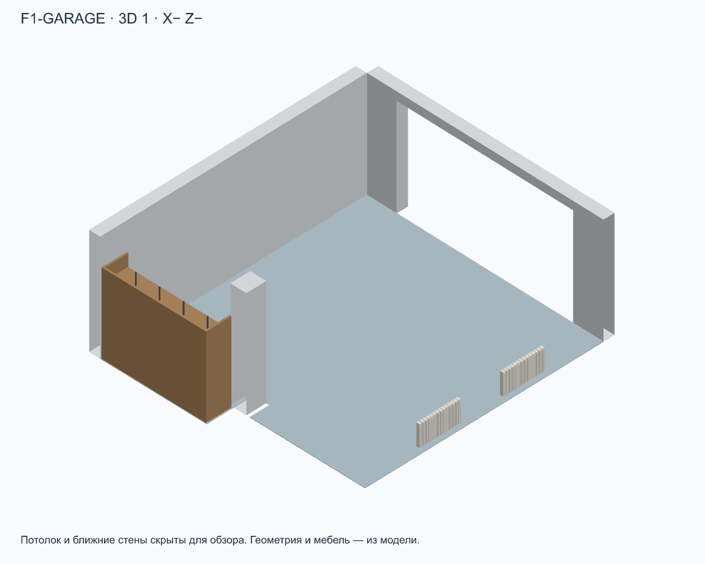
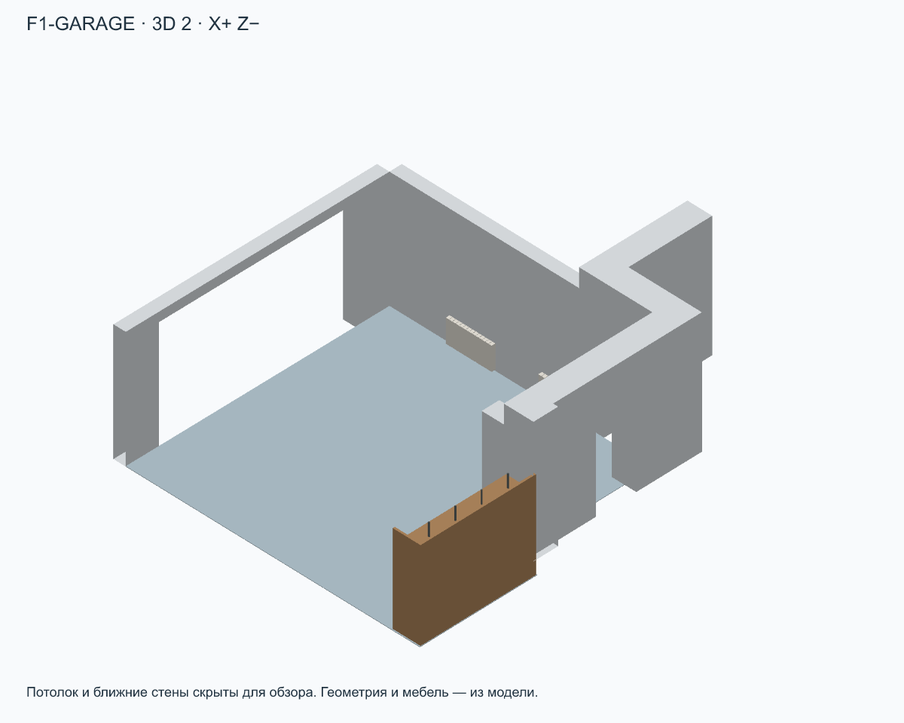
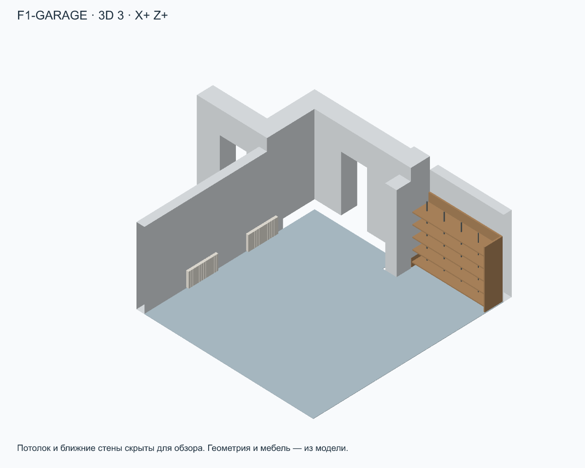
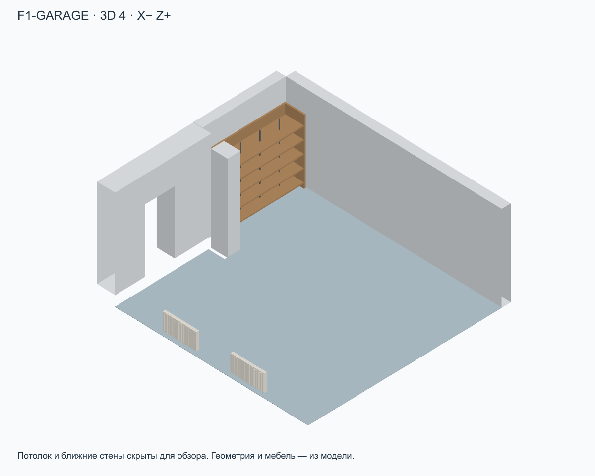
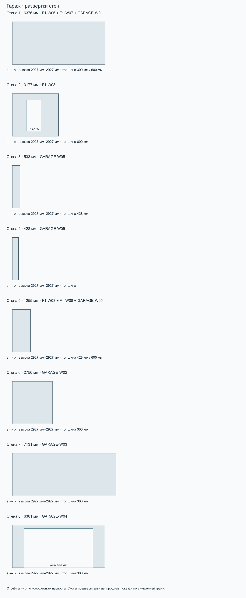

# Гараж · F1-GARAGE

Этаж 1 · площадь 42.42 м² · максимальная высота 2927 мм · отметка пола -350 мм.

Ревизия: 2026-09-10-electrical-layer. SHA-256: d48c66d8b73d4ce156ca1604a086feba42e80d3b62dfe9c58db21eca0daff0e9.

[Все комнаты](../README.md) · [Комплект ZIP](room-kit.zip) · [Паспорт JSON](passport.json) · [Запрос](prompt.txt)

## Стены

| № | a → b: X, Z | Длина | ID модели |
| --- | --- | --- | --- |
| 1 | 5705 мм, 14271 мм → 5705 мм, 7895 мм | 6376 мм | F1-W06 + F1-W07 + GARAGE-W01 |
| 2 | 5705 мм, 7895 мм → 8882 мм, 7895 мм | 3177 мм | F1-W08 |
| 3 | 8882 мм, 7895 мм → 8882 мм, 8428 мм | 533 мм | GARAGE-W05 |
| 4 | 8882 мм, 8428 мм → 9310 мм, 8428 мм | 428 мм | GARAGE-W05 |
| 5 | 9310 мм, 8428 мм → 9310 мм, 7173 мм | 1255 мм | F1-W03 + F1-W08 + GARAGE-W05 |
| 6 | 9310 мм, 7173 мм → 12066 мм, 7173 мм | 2756 мм | GARAGE-W02 |
| 7 | 12066 мм, 7173 мм → 12066 мм, 14304 мм | 7131 мм | GARAGE-W03 |
| 8 | 12066 мм, 14304 мм → 5705 мм, 14271 мм | 6361 мм | GARAGE-W04 |

## Окна, двери и проходы

| Стена | ID | Тип | Ширина × высота | Отступ от a | Низ от пола |
| --- | --- | --- | --- | --- | --- |
| 2 | F1-EXT02 | door | 980 мм × 2140 мм | 990 мм | 350 мм |
| 8 | GARAGE-GATE | garage-door | 4743 мм × 2700 мм | 798 мм | 0 мм |

## Мебель и оборудование

| На плане | ID | Тип | Ш × В × Г | Центр X, Z | Поворот | Низ от пола |
| --- | --- | --- | --- | --- | --- | --- |
| M1 | F1-GARAGE-TOOL-RACK | tool-rack | 2800 мм × 2200 мм × 675 мм | 10642 мм, 7518 мм | 0° | 0 мм |
| M2 | F1-RAD05 | radiator-sectional | 1120 мм × 570 мм × 90 мм | 5805 мм, 9963 мм | 90° | 100 мм |
| M3 | F1-RAD06 | radiator-sectional | 1120 мм × 570 мм × 90 мм | 5805 мм, 12203 мм | 90° | 100 мм |

## Ограничения

- План — внутренний контур. Номер стены соответствует развёртке; a→b задаёт направление отсчёта проёмов.
- Проёмы faces.openings: start от a внутренней грани, sill от пола комнаты. Не путать с осевыми start в исходной модели.
- Мебель: position=[X,Z] — центр, size=[ширина,высота,глубина], rotation — градусы по часовой стрелке на плане, resolvedElevation — низ от пола комнаты.
- Профили высот дискретизированы по внутренней грани стены (100 интервалов); точная геометрия — buildHouse/GLB. Скосы предварительные.
- 3D-виды — ортографические схемы из модели. Потолок и ближние стены скрыты только для обзора. Цвета условные.
- Граница комнаты без номера стены — открытое сопряжение, а не новая перегородка. Дверные полотна и направления открывания не заданы.

Расстановка по листам 8–9 (страницы PDF 9–10), адаптирована к текущим внутренним граням RoomPlan без изменения здания. position=[X,Z] — центр; size=[ширина,высота,глубина] в локальных осях, rotation — градусы по часовой стрелке на плане. Размеры с подписями перенесены по плану; прочие габариты, высоты, материалы и детализация условные. Высокие шкафы у скосов понижены. Диваны показаны сложенными. Сантехника входит в слой. В прихожей исходные консоль и пуф удалены, добавлен условный встроенный шкаф в левой нише; в кабинете шкаф у прохода удалён, дальний шкаф расширен до стены, а стол объединён с подоконником по фото; в ванной добавлен полотенцесушитель на левой стене; в гараж добавлен условный стеллаж для инструментов в нише; бойлерная остаётся без расстановки. Уточнение владельца 10.09.2026: гардеробная П-образная, столик удалён; в F2-ROOM добавлены полки от входа до шкафа; шкаф детской удлинён до 2,70 м; кресла гостиной и F2-ROOM развёрнуты в комнату и отодвинуты от торшеров. Новые размеры мебели условные.

Полные допущения и источники — в passport.json.

## Запрос для ИИ

Комната: Гараж (F1-GARAGE). Ревизия: 2026-09-10-electrical-layer.

Используй комплект комнаты как основу для визуализации интерьера. Сначала прочитай паспорт и посмотри план, все 3D-виды и развёртки. Сохрани внутренний контур, высоты, скосы, размеры и положение окон, дверей, мебели и оборудования. Меняй отделку, цвета, материалы и освещение в стиле [УКАЖИ СТИЛЬ]. Не добавляй проёмы, перегородки или мебель, не переставляй предметы без моего запроса. Отсутствующие на обзорном ракурсе стены и потолок скрыты для обзора: восстанови их по паспорту и развёрткам. Не интерпретируй направления X/Z как стороны света. Условные размеры не называй подтверждёнными обмерами. Если файлы или изображения недоступны, попроси приложить комплект, а не придумывай геометрию. Перед генерацией кратко перечисли прочитанные файлы и ограничения комнаты. Генерация изображения — визуальная концепция; точность проверяется по модели.
