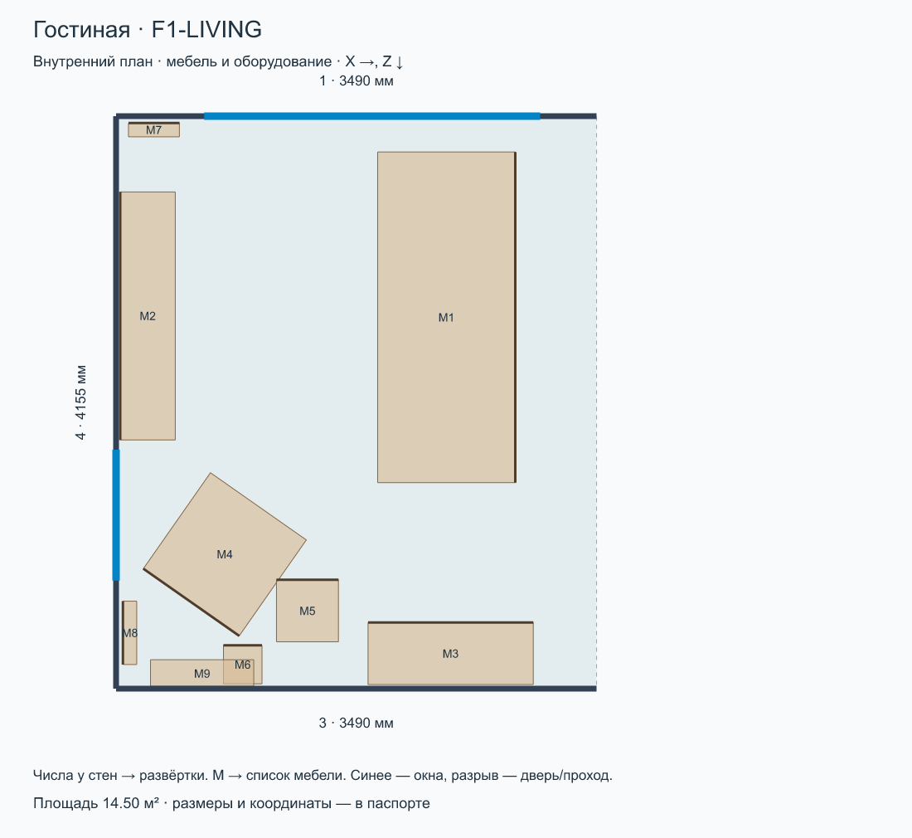
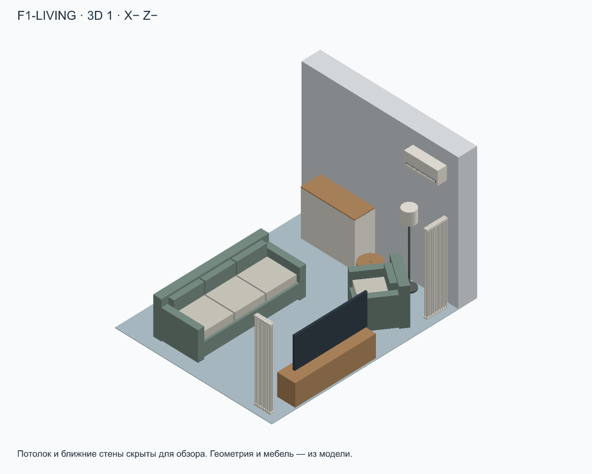
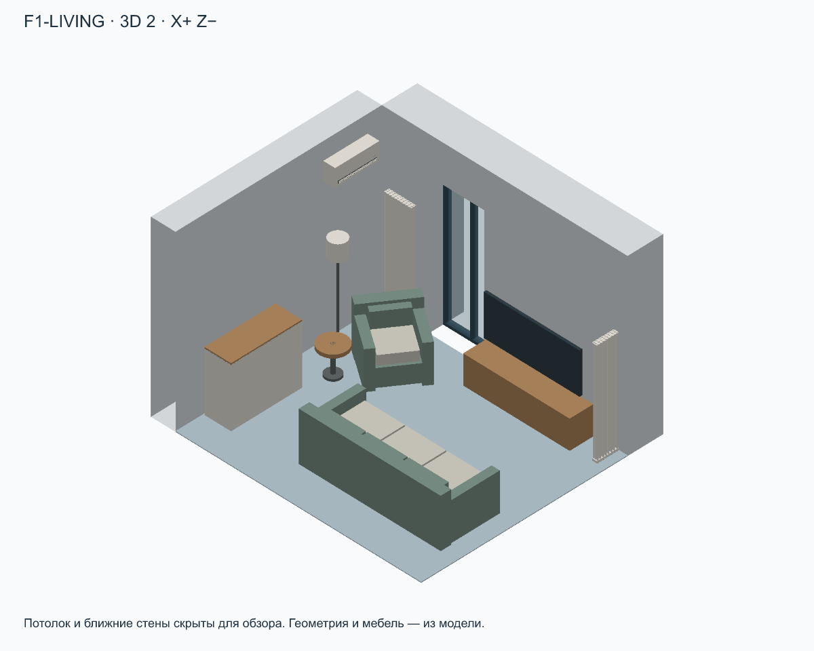
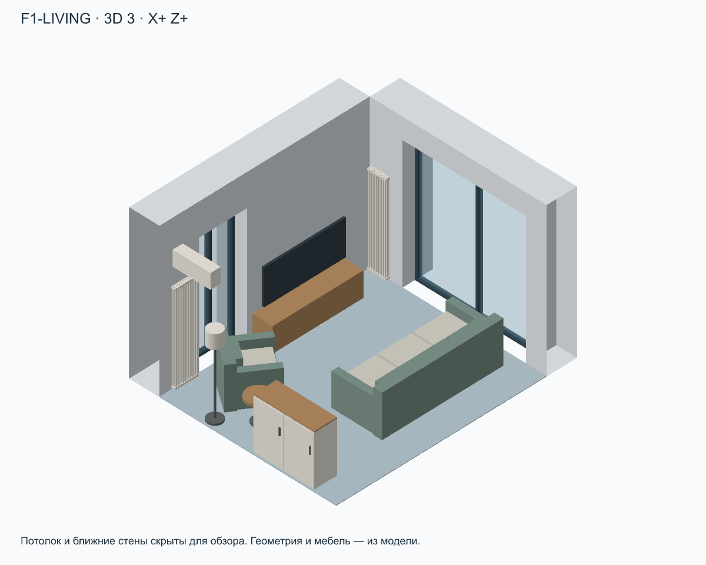
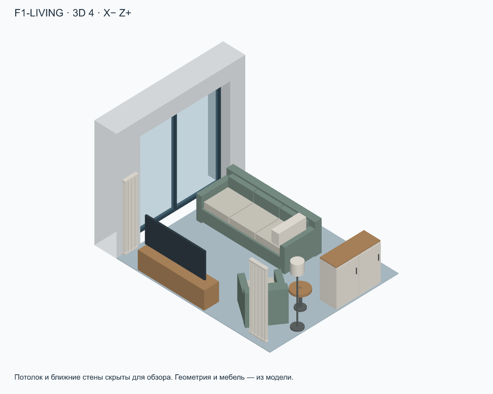
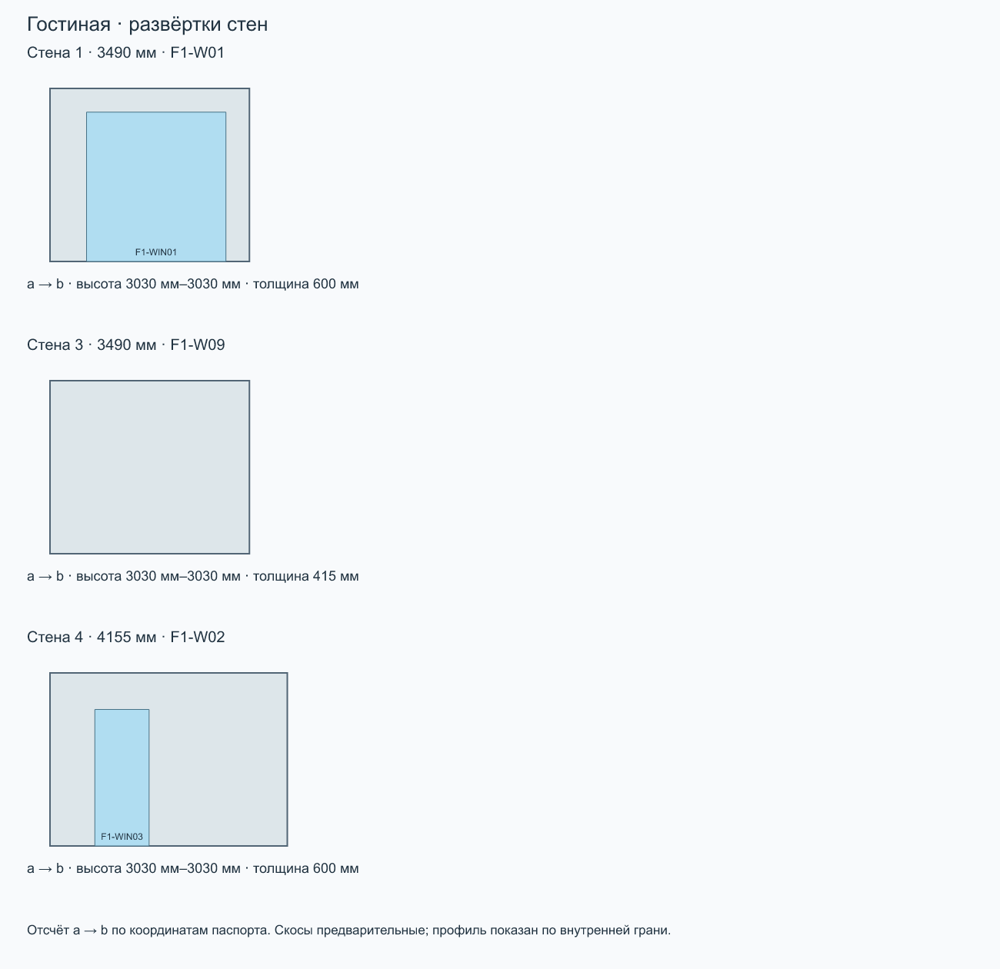

# Гостиная · F1-LIVING

Этаж 1 · площадь 14.50 м² · максимальная высота 3030 мм · отметка пола 0 мм.

Ревизия: 2026-09-10-electrical-layer. SHA-256: d48c66d8b73d4ce156ca1604a086feba42e80d3b62dfe9c58db21eca0daff0e9.

[Все комнаты](../README.md) · [Комплект ZIP](room-kit.zip) · [Паспорт JSON](passport.json) · [Запрос](prompt.txt)

## Стены

| № | a → b: X, Z | Длина | ID модели |
| --- | --- | --- | --- |
| 1 | 0 мм, 0 мм → 3490 мм, 0 мм | 3490 мм | F1-W01 |
| 3 | 3490 мм, 4155 мм → 0 мм, 4155 мм | 3490 мм | F1-W09 |
| 4 | 0 мм, 4155 мм → 0 мм, 0 мм | 4155 мм | F1-W02 |

## Окна, двери и проходы

| Стена | ID | Тип | Ширина × высота | Отступ от a | Низ от пола |
| --- | --- | --- | --- | --- | --- |
| 1 | F1-WIN01 | window | 2440 мм × 2615 мм | 640 мм | 0 мм |
| 4 | F1-WIN03 | window | 950 мм × 2390 мм | 785 мм | 0 мм |

## Мебель и оборудование

| На плане | ID | Тип | Ш × В × Г | Центр X, Z | Поворот | Низ от пола |
| --- | --- | --- | --- | --- | --- | --- |
| M1 | F1-FUR-SOFA | sofa | 2400 мм × 850 мм × 1000 мм | 2400 мм, 1460 мм | 90° | 0 мм |
| M2 | F1-FUR-TV | tv | 1800 мм × 1350 мм × 400 мм | 230 мм, 1450 мм | -90° | 0 мм |
| M3 | F1-FUR-SIDEBOARD | cabinet | 1200 мм × 1050 мм × 450 мм | 2430 мм, 3900 мм | 0° | 0 мм |
| M4 | F1-FUR-ARMCHAIR | sofa | 850 мм × 850 мм × 850 мм | 790 мм, 3180 мм | -145° | 0 мм |
| M5 | F1-FUR-SIDE-TABLE | roundTable | 450 мм × 500 мм × 450 мм | 1390 мм, 3590 мм | 0° | 0 мм |
| M6 | F1-FUR-LAMP | lamp | 280 мм × 1650 мм × 280 мм | 920 мм, 3980 мм | 0° | 0 мм |
| M7 | F1-RAD01 | radiator-tubular | 370 мм × 1800 мм × 100 мм | 275 мм, 100 мм | 0° | 100 мм |
| M8 | F1-RAD03 | radiator-tubular | 460 мм × 1800 мм × 100 мм | 100 мм, 3750 мм | -90° | 100 мм |
| M9 | F1-AC01 | air-conditioner | 750 мм × 300 мм × 200 мм | 625 мм, 4045 мм | 180° | 2440 мм |

## Ограничения

- План — внутренний контур. Номер стены соответствует развёртке; a→b задаёт направление отсчёта проёмов.
- Проёмы faces.openings: start от a внутренней грани, sill от пола комнаты. Не путать с осевыми start в исходной модели.
- Мебель: position=[X,Z] — центр, size=[ширина,высота,глубина], rotation — градусы по часовой стрелке на плане, resolvedElevation — низ от пола комнаты.
- Профили высот дискретизированы по внутренней грани стены (100 интервалов); точная геометрия — buildHouse/GLB. Скосы предварительные.
- 3D-виды — ортографические схемы из модели. Потолок и ближние стены скрыты только для обзора. Цвета условные.
- Граница комнаты без номера стены — открытое сопряжение, а не новая перегородка. Дверные полотна и направления открывания не заданы.

Расстановка по листам 8–9 (страницы PDF 9–10), адаптирована к текущим внутренним граням RoomPlan без изменения здания. position=[X,Z] — центр; size=[ширина,высота,глубина] в локальных осях, rotation — градусы по часовой стрелке на плане. Размеры с подписями перенесены по плану; прочие габариты, высоты, материалы и детализация условные. Высокие шкафы у скосов понижены. Диваны показаны сложенными. Сантехника входит в слой. В прихожей исходные консоль и пуф удалены, добавлен условный встроенный шкаф в левой нише; в кабинете шкаф у прохода удалён, дальний шкаф расширен до стены, а стол объединён с подоконником по фото; в ванной добавлен полотенцесушитель на левой стене; в гараж добавлен условный стеллаж для инструментов в нише; бойлерная остаётся без расстановки. Уточнение владельца 10.09.2026: гардеробная П-образная, столик удалён; в F2-ROOM добавлены полки от входа до шкафа; шкаф детской удлинён до 2,70 м; кресла гостиной и F2-ROOM развёрнуты в комнату и отодвинуты от торшеров. Новые размеры мебели условные.

Полные допущения и источники — в passport.json.

## Запрос для ИИ

Комната: Гостиная (F1-LIVING). Ревизия: 2026-09-10-electrical-layer.

Используй комплект комнаты как основу для визуализации интерьера. Сначала прочитай паспорт и посмотри план, все 3D-виды и развёртки. Сохрани внутренний контур, высоты, скосы, размеры и положение окон, дверей, мебели и оборудования. Меняй отделку, цвета, материалы и освещение в стиле [УКАЖИ СТИЛЬ]. Не добавляй проёмы, перегородки или мебель, не переставляй предметы без моего запроса. Отсутствующие на обзорном ракурсе стены и потолок скрыты для обзора: восстанови их по паспорту и развёрткам. Не интерпретируй направления X/Z как стороны света. Условные размеры не называй подтверждёнными обмерами. Если файлы или изображения недоступны, попроси приложить комплект, а не придумывай геометрию. Перед генерацией кратко перечисли прочитанные файлы и ограничения комнаты. Генерация изображения — визуальная концепция; точность проверяется по модели.
