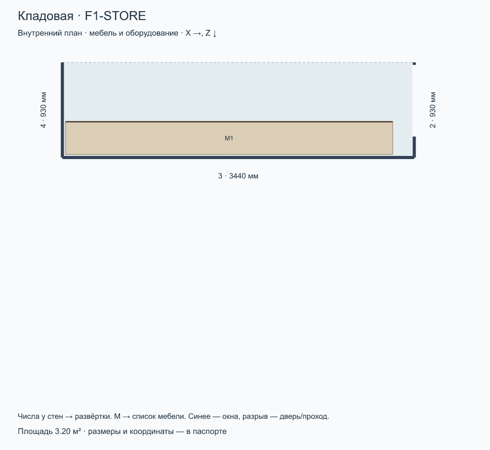
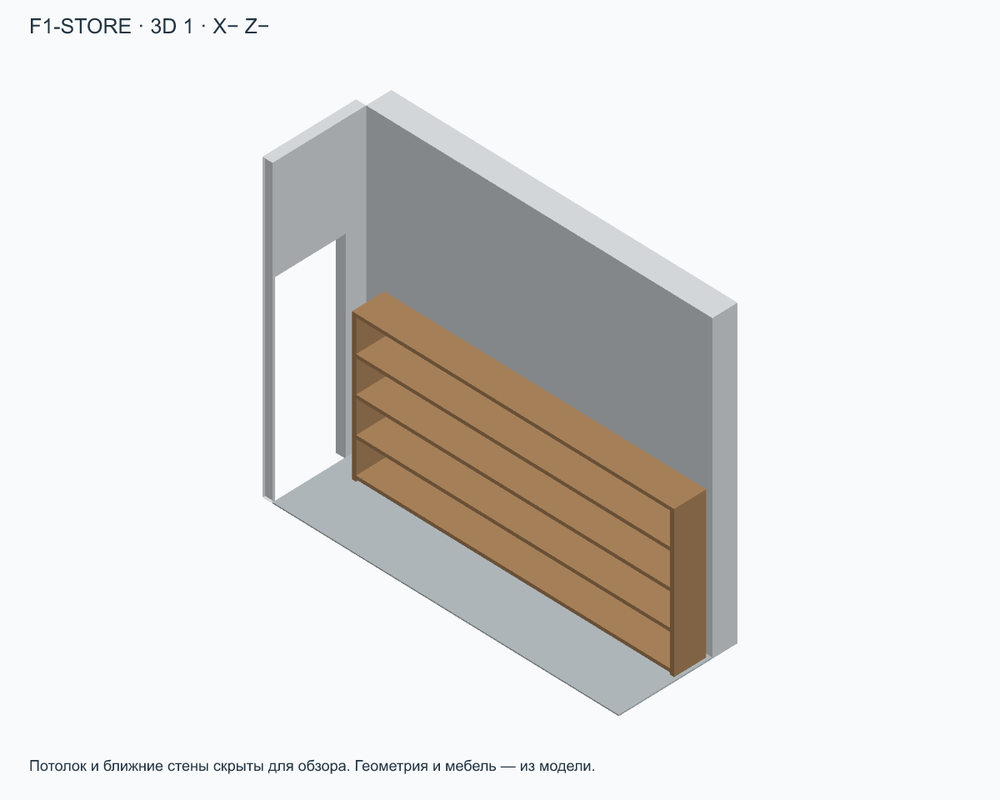
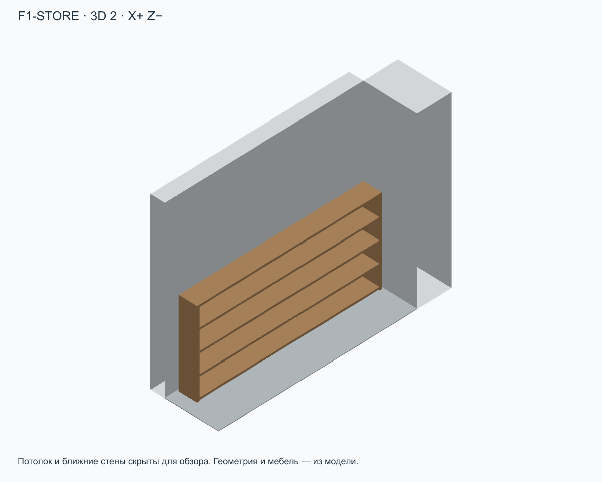
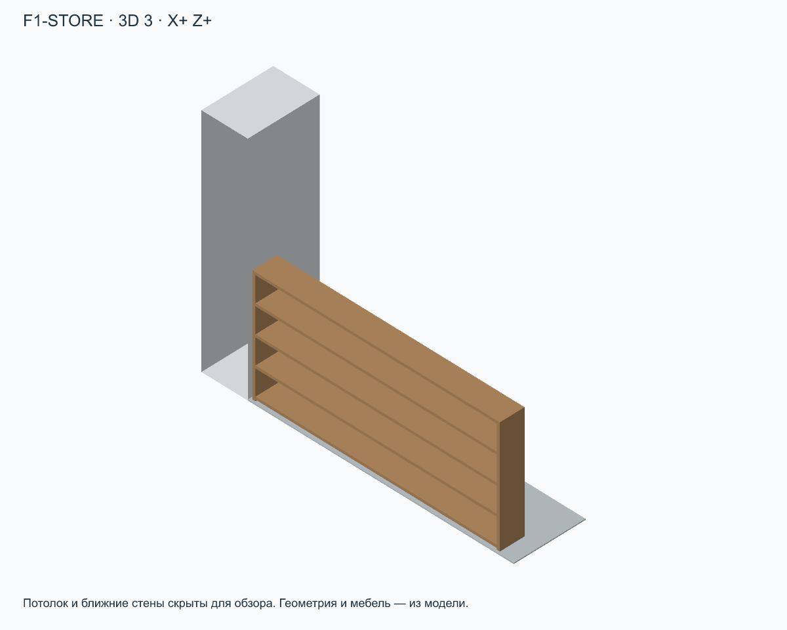
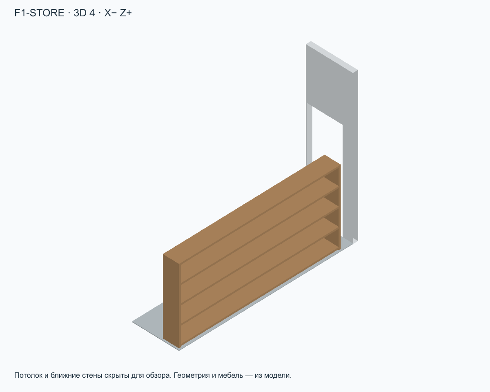
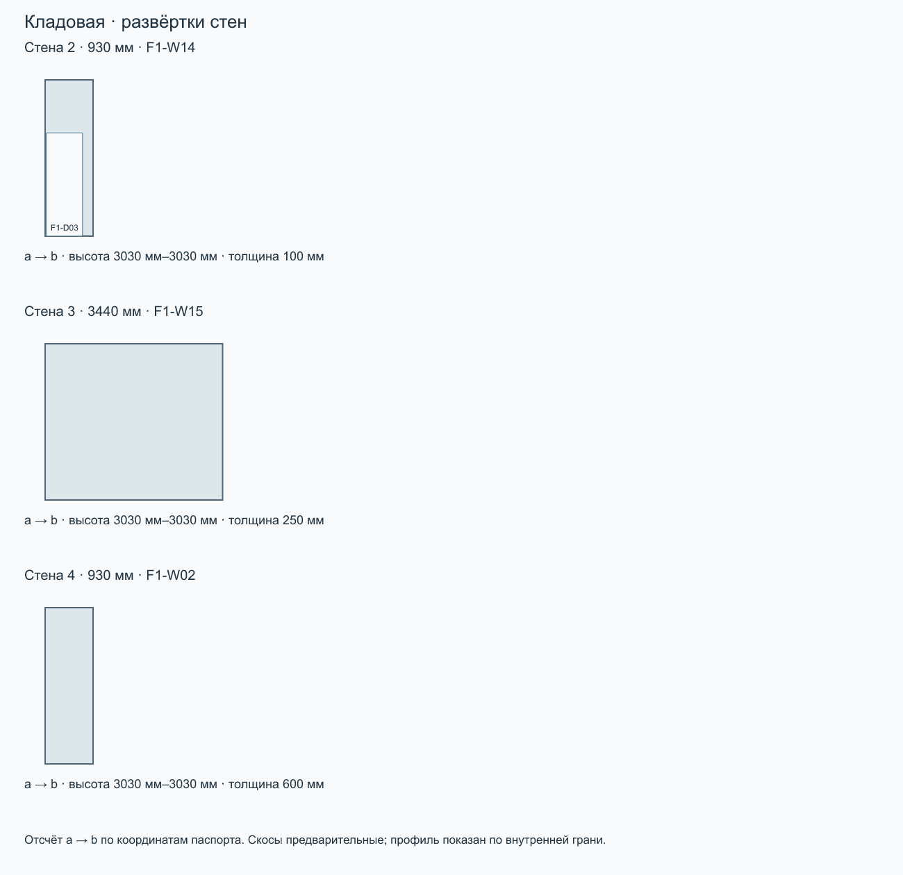

# Кладовая · F1-STORE

Этаж 1 · площадь 3.20 м² · максимальная высота 3030 мм · отметка пола 0 мм.

Ревизия: 2026-09-10-electrical-layer. SHA-256: d48c66d8b73d4ce156ca1604a086feba42e80d3b62dfe9c58db21eca0daff0e9.

[Все комнаты](../README.md) · [Комплект ZIP](room-kit.zip) · [Паспорт JSON](passport.json) · [Запрос](prompt.txt)

## Стены

| № | a → b: X, Z | Длина | ID модели |
| --- | --- | --- | --- |
| 2 | 3440 мм, 5760 мм → 3440 мм, 6690 мм | 930 мм | F1-W14 |
| 3 | 3440 мм, 6690 мм → 0 мм, 6690 мм | 3440 мм | F1-W15 |
| 4 | 0 мм, 6690 мм → 0 мм, 5760 мм | 930 мм | F1-W02 |

## Окна, двери и проходы

| Стена | ID | Тип | Ширина × высота | Отступ от a | Низ от пола |
| --- | --- | --- | --- | --- | --- |
| 2 | F1-D03 | door | 700 мм × 2000 мм | 25 мм | 0 мм |

## Мебель и оборудование

| На плане | ID | Тип | Ш × В × Г | Центр X, Z | Поворот | Низ от пола |
| --- | --- | --- | --- | --- | --- | --- |
| M1 | F1-FUR-STORE-SHELVES | shelf | 3200 мм × 1500 мм × 320 мм | 1630 мм, 6500 мм | 0° | 0 мм |

## Ограничения

- План — внутренний контур. Номер стены соответствует развёртке; a→b задаёт направление отсчёта проёмов.
- Проёмы faces.openings: start от a внутренней грани, sill от пола комнаты. Не путать с осевыми start в исходной модели.
- Мебель: position=[X,Z] — центр, size=[ширина,высота,глубина], rotation — градусы по часовой стрелке на плане, resolvedElevation — низ от пола комнаты.
- Профили высот дискретизированы по внутренней грани стены (100 интервалов); точная геометрия — buildHouse/GLB. Скосы предварительные.
- 3D-виды — ортографические схемы из модели. Потолок и ближние стены скрыты только для обзора. Цвета условные.
- Граница комнаты без номера стены — открытое сопряжение, а не новая перегородка. Дверные полотна и направления открывания не заданы.
- Над лестницей/под лестницей есть переменная геометрия маршей; maximumHeight — высота этажа, не свободная высота каждой точки. Используйте GLB для проверки просветов.

Расстановка по листам 8–9 (страницы PDF 9–10), адаптирована к текущим внутренним граням RoomPlan без изменения здания. position=[X,Z] — центр; size=[ширина,высота,глубина] в локальных осях, rotation — градусы по часовой стрелке на плане. Размеры с подписями перенесены по плану; прочие габариты, высоты, материалы и детализация условные. Высокие шкафы у скосов понижены. Диваны показаны сложенными. Сантехника входит в слой. В прихожей исходные консоль и пуф удалены, добавлен условный встроенный шкаф в левой нише; в кабинете шкаф у прохода удалён, дальний шкаф расширен до стены, а стол объединён с подоконником по фото; в ванной добавлен полотенцесушитель на левой стене; в гараж добавлен условный стеллаж для инструментов в нише; бойлерная остаётся без расстановки. Уточнение владельца 10.09.2026: гардеробная П-образная, столик удалён; в F2-ROOM добавлены полки от входа до шкафа; шкаф детской удлинён до 2,70 м; кресла гостиной и F2-ROOM развёрнуты в комнату и отодвинуты от торшеров. Новые размеры мебели условные.

Полные допущения и источники — в passport.json.

## Запрос для ИИ

Комната: Кладовая (F1-STORE). Ревизия: 2026-09-10-electrical-layer.

Используй комплект комнаты как основу для визуализации интерьера. Сначала прочитай паспорт и посмотри план, все 3D-виды и развёртки. Сохрани внутренний контур, высоты, скосы, размеры и положение окон, дверей, мебели и оборудования. Меняй отделку, цвета, материалы и освещение в стиле [УКАЖИ СТИЛЬ]. Не добавляй проёмы, перегородки или мебель, не переставляй предметы без моего запроса. Отсутствующие на обзорном ракурсе стены и потолок скрыты для обзора: восстанови их по паспорту и развёрткам. Не интерпретируй направления X/Z как стороны света. Условные размеры не называй подтверждёнными обмерами. Если файлы или изображения недоступны, попроси приложить комплект, а не придумывай геометрию. Перед генерацией кратко перечисли прочитанные файлы и ограничения комнаты. Генерация изображения — визуальная концепция; точность проверяется по модели.
