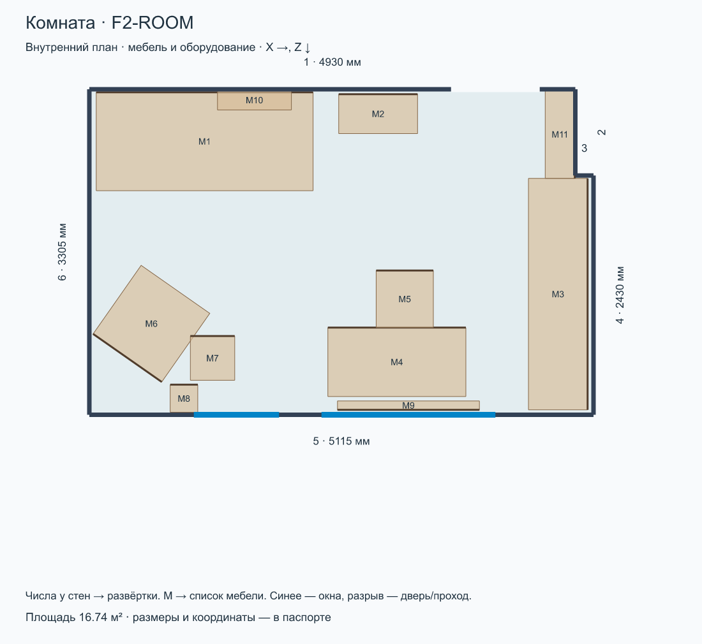
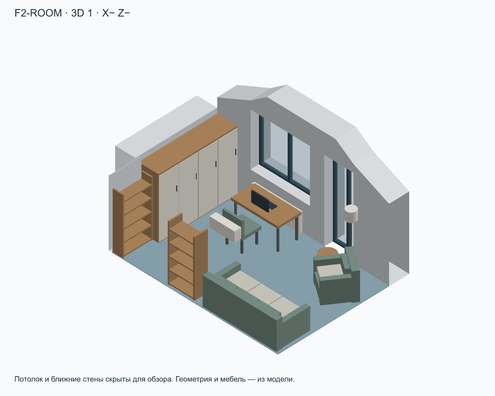
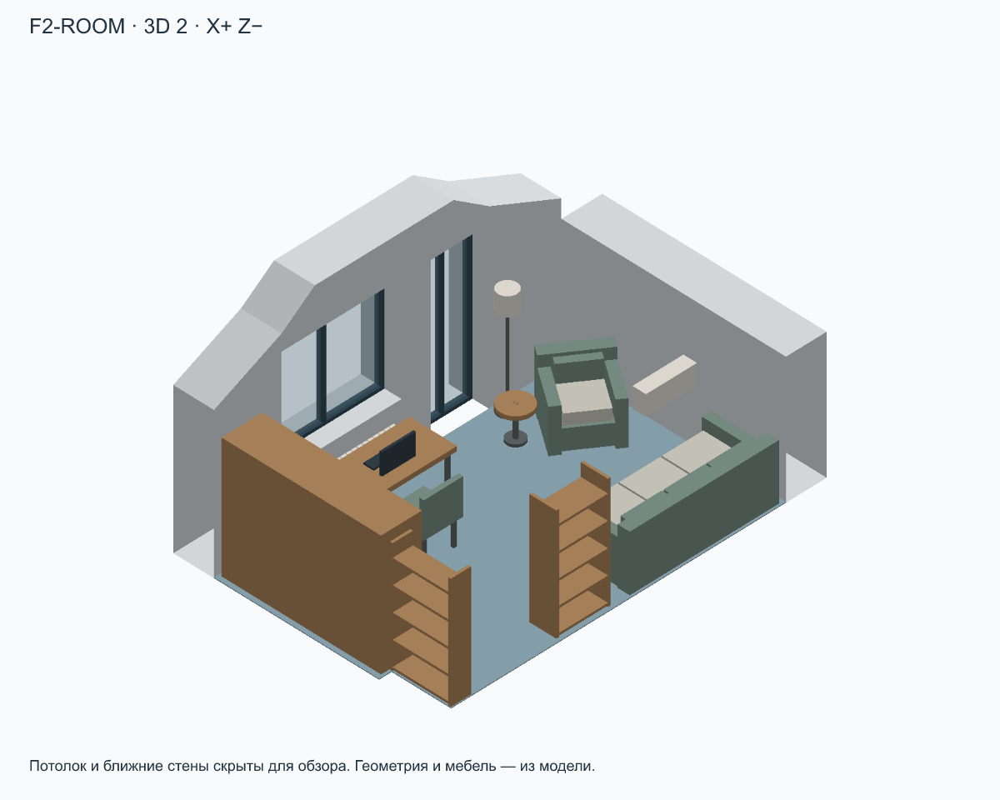
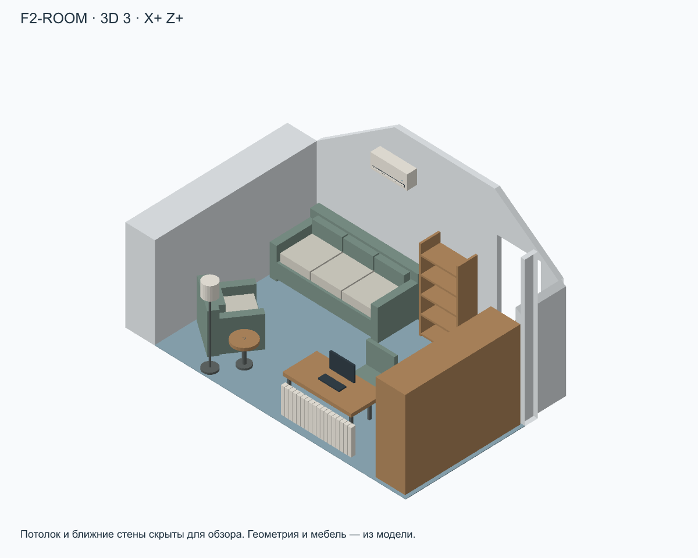
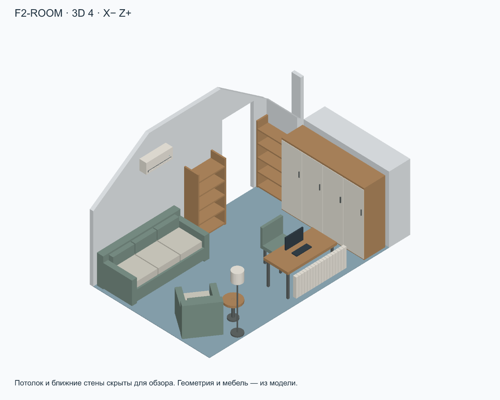
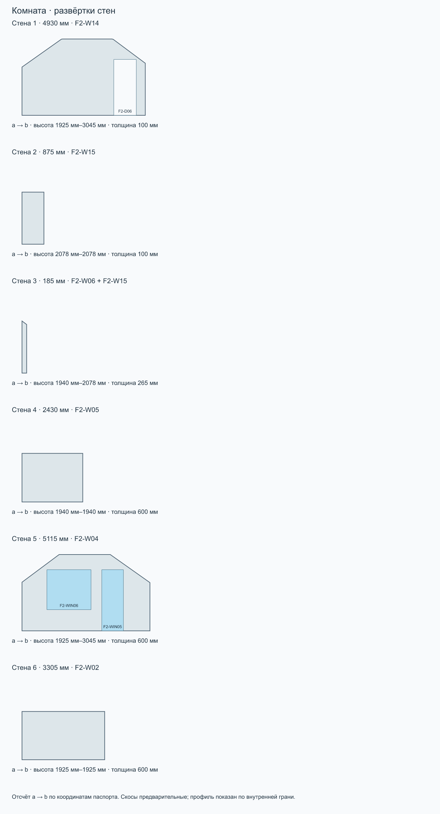

# Комната · F2-ROOM

Этаж 2 · площадь 16.74 м² · максимальная высота 3045 мм · отметка пола 3250 мм.

Ревизия: 2026-09-10-electrical-layer. SHA-256: d48c66d8b73d4ce156ca1604a086feba42e80d3b62dfe9c58db21eca0daff0e9.

[Все комнаты](../README.md) · [Комплект ZIP](room-kit.zip) · [Паспорт JSON](passport.json) · [Запрос](prompt.txt)

## Стены

| № | a → b: X, Z | Длина | ID модели |
| --- | --- | --- | --- |
| 1 | 0 мм, 6770 мм → 4930 мм, 6770 мм | 4930 мм | F2-W14 |
| 2 | 4930 мм, 6770 мм → 4930 мм, 7645 мм | 875 мм | F2-W15 |
| 3 | 4930 мм, 7645 мм → 5115 мм, 7645 мм | 185 мм | F2-W06 + F2-W15 |
| 4 | 5115 мм, 7645 мм → 5115 мм, 10075 мм | 2430 мм | F2-W05 |
| 5 | 5115 мм, 10075 мм → 0 мм, 10075 мм | 5115 мм | F2-W04 |
| 6 | 0 мм, 10075 мм → 0 мм, 6770 мм | 3305 мм | F2-W02 |

## Окна, двери и проходы

| Стена | ID | Тип | Ширина × высота | Отступ от a | Низ от пола |
| --- | --- | --- | --- | --- | --- |
| 1 | F2-D06 | door | 900 мм × 2230 мм | 3670 мм | 0 мм |
| 5 | F2-WIN06 | window | 1765 мм × 1595 мм | 995 мм | 845 мм |
| 5 | F2-WIN05 | window | 865 мм × 2440 мм | 3190 мм | 0 мм |

## Мебель и оборудование

| На плане | ID | Тип | Ш × В × Г | Центр X, Z | Поворот | Низ от пола |
| --- | --- | --- | --- | --- | --- | --- |
| M1 | F2-FUR-GUEST-SOFA | sofa | 2200 мм × 850 мм × 1000 мм | 1170 мм, 7300 мм | 0° | 0 мм |
| M2 | F2-FUR-GUEST-BOOKCASE | shelf | 800 мм × 1700 мм × 400 мм | 2930 мм, 7020 мм | 0° | 0 мм |
| M3 | F2-FUR-GUEST-WARDROBE | wardrobe | 2350 мм × 1850 мм × 600 мм | 4755 мм, 8850 мм | 90° | 0 мм |
| M4 | F2-FUR-GUEST-DESK | desk | 1400 мм × 750 мм × 700 мм | 3120 мм, 9540 мм | 0° | 0 мм |
| M5 | F2-FUR-GUEST-CHAIR | chair | 580 мм × 940 мм × 580 мм | 3200 мм, 8900 мм | 0° | 0 мм |
| M6 | F2-FUR-GUEST-ARMCHAIR | sofa | 850 мм × 850 мм × 850 мм | 630 мм, 9150 мм | -145° | 0 мм |
| M7 | F2-FUR-GUEST-TABLE | roundTable | 450 мм × 500 мм × 450 мм | 1250 мм, 9500 мм | 0° | 0 мм |
| M8 | F2-FUR-GUEST-LAMP | lamp | 280 мм × 1650 мм × 280 мм | 960 мм, 9910 мм | 0° | 0 мм |
| M9 | F2-RAD05 | radiator-sectional | 1440 мм × 540 мм × 90 мм | 3238 мм, 9980 мм | 180° | 100 мм |
| M10 | F2-AC03 | air-conditioner | 750 мм × 300 мм × 200 мм | 1675 мм, 6880 мм | 0° | 2253 мм |
| M11 | F2-FUR-GUEST-ENTRY-SHELVES | shelf | 895 мм × 1700 мм × 300 мм | 4775 мм, 7228 мм | 90° | 0 мм |

## Ограничения

- План — внутренний контур. Номер стены соответствует развёртке; a→b задаёт направление отсчёта проёмов.
- Проёмы faces.openings: start от a внутренней грани, sill от пола комнаты. Не путать с осевыми start в исходной модели.
- Мебель: position=[X,Z] — центр, size=[ширина,высота,глубина], rotation — градусы по часовой стрелке на плане, resolvedElevation — низ от пола комнаты.
- Профили высот дискретизированы по внутренней грани стены (100 интервалов); точная геометрия — buildHouse/GLB. Скосы предварительные.
- 3D-виды — ортографические схемы из модели. Потолок и ближние стены скрыты только для обзора. Цвета условные.
- Граница комнаты без номера стены — открытое сопряжение, а не новая перегородка. Дверные полотна и направления открывания не заданы.

Расстановка по листам 8–9 (страницы PDF 9–10), адаптирована к текущим внутренним граням RoomPlan без изменения здания. position=[X,Z] — центр; size=[ширина,высота,глубина] в локальных осях, rotation — градусы по часовой стрелке на плане. Размеры с подписями перенесены по плану; прочие габариты, высоты, материалы и детализация условные. Высокие шкафы у скосов понижены. Диваны показаны сложенными. Сантехника входит в слой. В прихожей исходные консоль и пуф удалены, добавлен условный встроенный шкаф в левой нише; в кабинете шкаф у прохода удалён, дальний шкаф расширен до стены, а стол объединён с подоконником по фото; в ванной добавлен полотенцесушитель на левой стене; в гараж добавлен условный стеллаж для инструментов в нише; бойлерная остаётся без расстановки. Уточнение владельца 10.09.2026: гардеробная П-образная, столик удалён; в F2-ROOM добавлены полки от входа до шкафа; шкаф детской удлинён до 2,70 м; кресла гостиной и F2-ROOM развёрнуты в комнату и отодвинуты от торшеров. Новые размеры мебели условные.

Полные допущения и источники — в passport.json.

## Запрос для ИИ

Комната: Комната (F2-ROOM). Ревизия: 2026-09-10-electrical-layer.

Используй комплект комнаты как основу для визуализации интерьера. Сначала прочитай паспорт и посмотри план, все 3D-виды и развёртки. Сохрани внутренний контур, высоты, скосы, размеры и положение окон, дверей, мебели и оборудования. Меняй отделку, цвета, материалы и освещение в стиле [УКАЖИ СТИЛЬ]. Не добавляй проёмы, перегородки или мебель, не переставляй предметы без моего запроса. Отсутствующие на обзорном ракурсе стены и потолок скрыты для обзора: восстанови их по паспорту и развёрткам. Не интерпретируй направления X/Z как стороны света. Условные размеры не называй подтверждёнными обмерами. Если файлы или изображения недоступны, попроси приложить комплект, а не придумывай геометрию. Перед генерацией кратко перечисли прочитанные файлы и ограничения комнаты. Генерация изображения — визуальная концепция; точность проверяется по модели.
